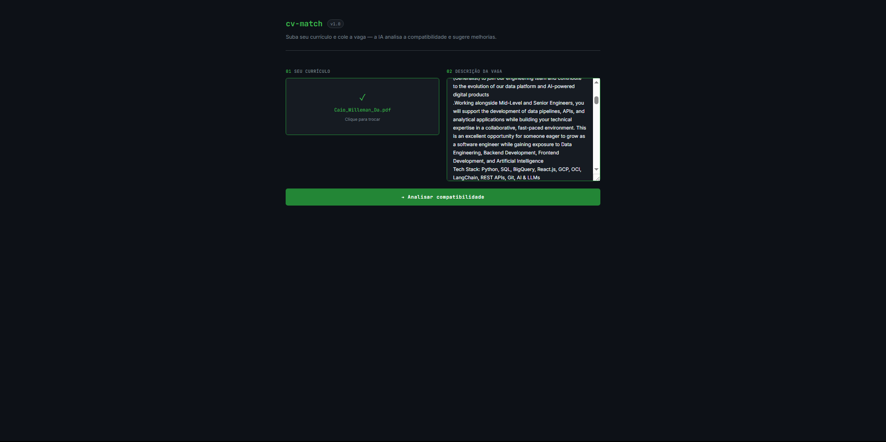
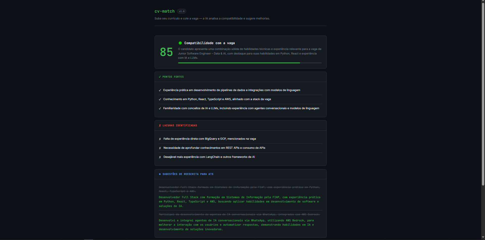
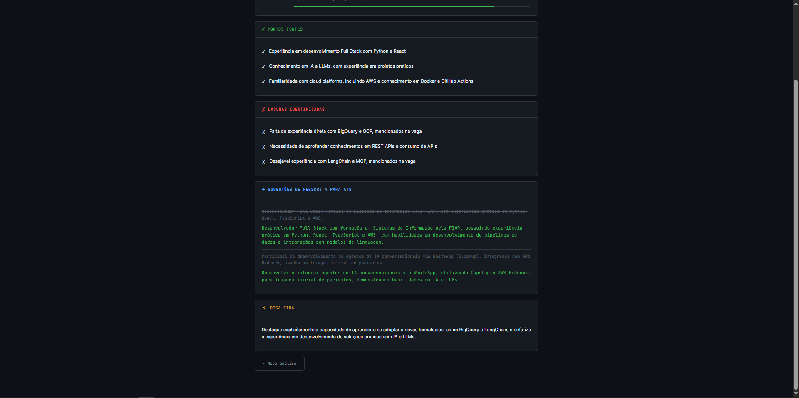

# cv-match

Ferramenta com IA que analisa seu currículo contra uma vaga e te diz exatamente o que ajustar para aumentar suas chances — funciona para qualquer área, não só tech.



## O que faz

- Lê seu currículo em PDF ou DOCX
- Analisa a compatibilidade com a vaga
- Gera um score de 0 a 100
- Aponta pontos fortes e lacunas
- Sugere reescritas otimizadas para ATS
- Dá uma dica final específica para aquela candidatura




## Como rodar

```bash
npm install
npm run dev
```

Acesse `http://localhost:5173`

## Tecnologias

- React 18 + Vite
- Groq API (Llama 3.3 70B)
- pdfjs-dist (leitura de PDF)
- mammoth (leitura de DOCX)
- CSS puro